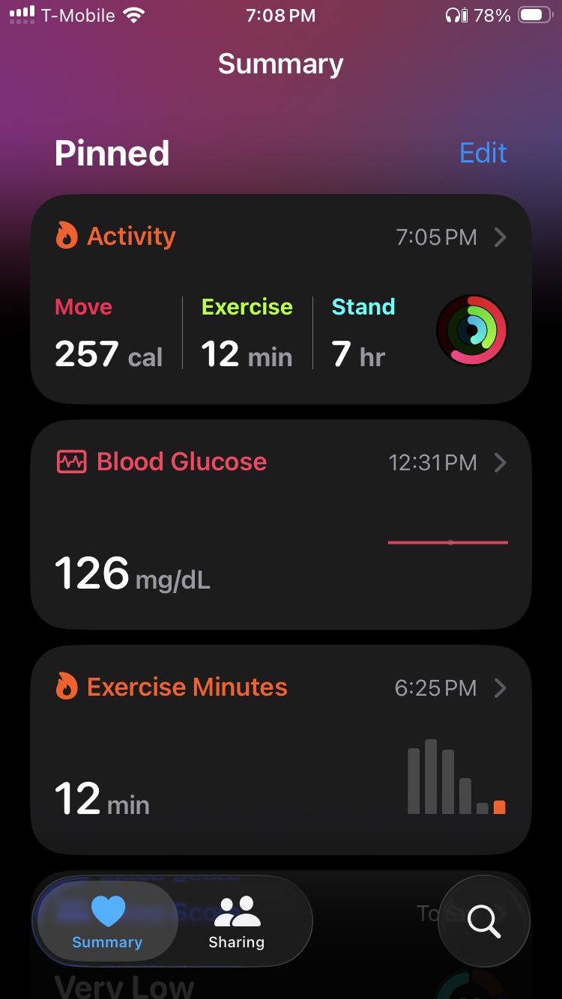
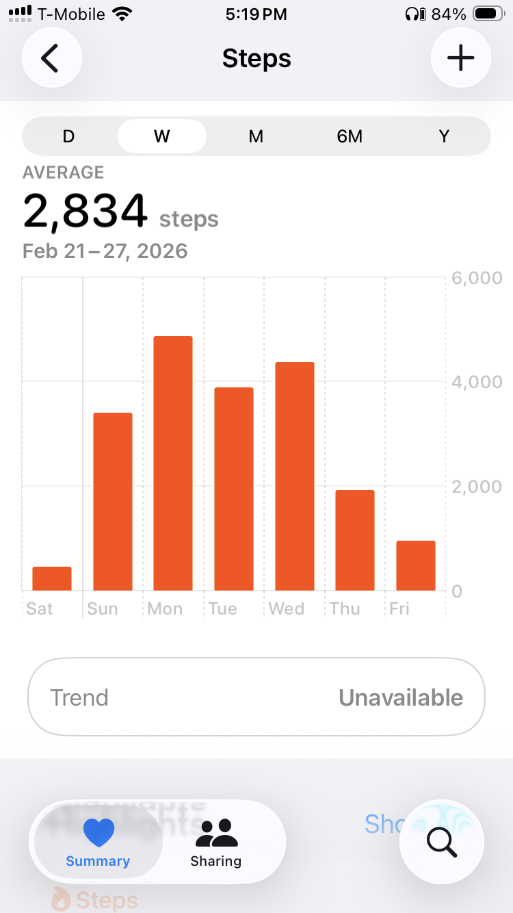
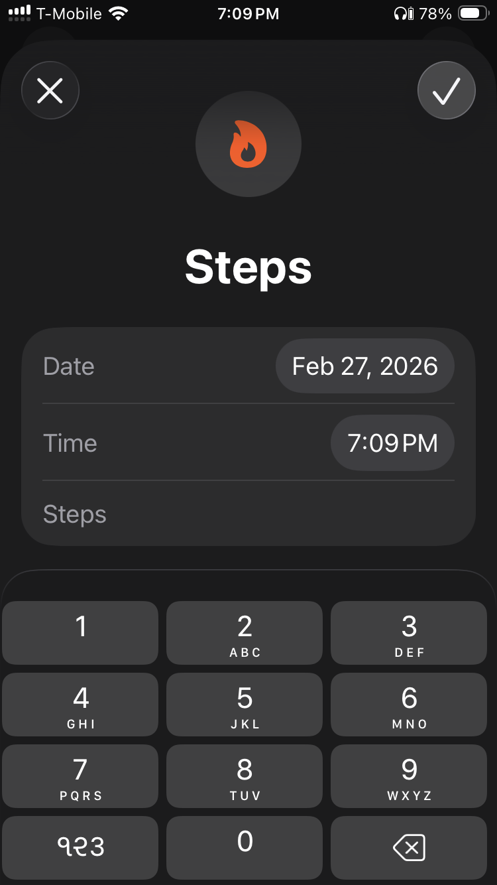

# Metrics Tracker

This will be a website that can easily be viewed on a mobile phone as well as on a desktop. Its purpose is to help the user track a bunch of metrics - their value along with the timestamp when it was recorded - and then analyze the movement of these metrics over time. They should be able to analyze individual metrics as well overlay multiple metrics and look at their movement over time.

By default is should be possible to group all metrics by timeseries with a configurable aggregate function, e.g., it should be possible to view the weekly average of exercise minutes. Here "exercise" is the metric, "minutes" is the unit of measurement, "average" is the aggregator function, and "weekly" is the property that is being grouped. In addition to timeseries, if a metric has properties, it should be able to group by properites as well. 

A metric is defined as follows:

* **Name:** The name of the metric, this can be any user defined value.
* **Value Type:** This type of value the metric measurement can take. It can be one of the following three types:
  * **Numeric:** These are real valued metrics where the user will provide a real number as the metric's measurement.
  * **Labeled:** These are categorical valued metrics where the user will provide one of several pre-defined strings as the metric's measurement.
  * **None:** These are metrics that are just logged, there is no measurement associated with it.
* **Unit:** The unit of the metric. This only applies to metrics with values. This will be a user provided string.
* **Properties:** A metric may have several properties. Of course it is possible for a metric to have no properties at all. Each property in turn is defined as follows:
  * *Name:* Name of the property, this can be any user defined value.
  * *Value Type:* The type of value the property can take. It can be one of the folowing types:
    * *Numeric:* User will provide a real number as the value of the property.
    * *Labels:* User will provide one of several pre-defined strings as the value of the property.

When the user logs a metric, the system will provide the timestamp of when the metric is being logged, and the user will provide the value of the metric if needed, and the values of any properties that the metric has.

## Examples

This section has some example metrics that illustrate the concepts of the metric definition and metric logs described above.

### Metric with no values

User wants to track whenever they meditate. 

#### Definition

* **Name:** Meditation
* **Value Type:** None

#### Logs

| recorded_at |
| ----------- |
| 1767619980  |
| 1769852880  |
| 1770687180  |

#### Filtering

This metric cannot be filtered.

#### Grouping

Only the default timeseries grouping is possible. `count` is the only aggregate function that can be used. Here is what it would look like -

**Weekly Meditation Count**

| Week   | Count |
| ------ | ----- |
| week 1 | 3     |
| week 2 | 4     |

### Metric with numeric values

User wants to monitor their weight over time. They measure their weight in lbs.

#### Definition

* **Name:** Weight
* **Value Type:** Numeric
* **Units:** lbs

#### Logs

| recorded_at | value |
| ----------- | ----- |
| 1767486480  | 180   |
| 1767996960  | 190   |
| 1770784620  | 183   |

#### Filtering

This metric cannot be filtered.

#### Grouping

Only default timeseries grouping is possbile. Various aggregate functions like `sum`, `average`, `median`, `standard_deviation`, etc. can be used. Here is what it can look like -

**Average Weekly Weight**

| Week   | Average |
| ------ | ------- |
| week 1 | 180.2   |
| week 2 | 192.4   |

### Metric with labeled values

User wants to track their mood throughout the day - whether they are "Happy", "Sad", "Angry", or "Serene".

#### Definition

* **Name:** Mood
* **Value Type:** Labeled
  * **Allowed Labels**: One of `Happy`, `Sad`, `Angry`, or `Serene`

#### Logs

| recorded_at | value  |
| ----------- | ------ |
| 1767996960  | Happy  |
| 1769872140  | Happy  |
| 1770732360  | Serene |
| 1770784620  | Sad    |
| 1771975380  | Happy  |

#### Filtering

This metric cannot be filtered.

#### Grouping

Timeseries is the first level of grouping, within that they can be grouped by their values. Only `count` aggregate function can be used, e.g., 

**Weekly Mood Count**

| Week   | Value                      | Count           |
| ------ | -------------------------- | --------------- |
| week 1 | Happy Sad Serene | 2 3 4 |
| week 2 | Happy Angry Sad  | 3 1 2 |

### Metric with labeled properties but no value

User wants to be mindful of what they eat. To that end they want to track the kind of meals they have, whether it is healthy or not, how tasty is it, wheather it filled them up or not, whether they cooked it at home, got it from a restaurant, or from a tiffin service.

#### Definition

* **Name:** Meal
* **Value Type**: None
* **Properties:**
  * *Name:* Source
    * *Value Type*: Labeled
    * *Allowed Values:* `Home-Cooked`, `Take-Out`, `Tiffin`
  * *Name:* Taste
    * *Value Type:* Labeled
    * *Allowed Values:* `Delicious`, `Edible`, `Bad`
  * *Name:* Is_Filling
    * *Value Type:* Labeled
    * *Allowed Value*: `True`, `False`
  * *Name:* Healthy
    * *Value Type:* Labeled
    * *Allowed Values:* `Very`, `Medium`, `No`

#### Logs

| recorded_on | source      | taste     | is_filling | healthy |
| ----------- | ----------- | --------- | ---------- | ------- |
| 1767486480  | home-cooked | delicious | True       | very    |
| 1767996960  | tiffin      | edible    | True       | medium  |
| 1769852880  | home-cooked | bad       | False      | very    |

#### Filtering

The metric can be filtered by any property/value, e.g., I can filter for all home cooked food that was tasty.

#### Grouping

The metric can be grouped by any property. Continuing the filtering example, I can group all home cooked food that was tasty by how healthy it was. Here is what it would look like -

**Weekly Count of source == "home-cooked" && taste == "delicious" Food grouped by Healthy** 

| Week   | Healthy                  | Count           |
| ------ | ------------------------ | --------------- |
| week 1 | very medium no | 3 4 1 |
| week 2 | very medium no | 5 2 0 |

### Metric with labeled properties and numeric values

User wants to track their blood glucose. They usually measure their blood glucose when they are fasting, one hour after breakfast, two hours after breakfast, or after a workout. At times they may also measure it on an ad-hoc basis.

#### Definition

* **Name:** Blood-Glucose
* **Value Type:** Numeric
* **Unit:** mg/dL
* **Properties:**
  * *Name:* Event
    * *Value Type*: Labeled
    * *Allowed Values:* `Fasting`, `Breakfast`, `Workout`, `Ad-Hoc`
  * *Name:* Delta
    * *Value Type:* Labeled
    * *Allowed Values:* `One-Hour-After`, `Two-Hours-After`

#### Logs

| recorded_on | event     | delta           | value |
| ----------- | --------- | --------------- | ----- |
| 1767619980  | fasting   |                 | 101   |
| 1767996960  | breakfast | one-hour-after  | 150   |
| 1769852880  | breakfast | two-hours-after | 120   |

#### Filtering

The metric can be filtered by any property/value, e.g., I can filter for readings that I took one hour after any event, so the filter is `delta == "one-hour-after"`.

#### Grouping

Can group by any property. Given the value is a real number, the aggregate function can be configured.  Grouping all breakfast meals by the delta will look like this -

**Weekly Average of event == "breakfast" Blood-Glucose by Delta**

| Week   | Delta                                           | Average               |
| ------ | ----------------------------------------------- | --------------------- |
| week 1 | before one-hour-after two-hours-after | 120 150 130 |
| week 2 | before one-hour-after two-hours-after | 120 150 130 |

### Metric with mixed properties and numeric values

User wants to keep track of the hikes they go on. The main metric they want to track is how long they hiked. Along with that they also want to track what was the elevation gain on the hike, how long it was, what kind of landscape was it - did it have waterfalls, was it on the coast, on the mountains, etc.

#### Definition

* **Name:** Hike
* **Value Type:** Numeric
* **Units:** Minutes
* **Properites:**
  * *Name:* Length
    * *Value Type:* Numeric
    * *Units:* Miles
  * *Name:* Elevation Gain
    * *Value Type:* Numeric
    * *Units:* Feet
  * *Name:* Landscape
    * *Value Type:* Labeled
    * *Allowed Values:* `Coastal`, `Lake`, `River`, `Mountain`, `Ridge`, `Woods`

#### Logs

| recorded_at | loop_length | elevation_gain | landscape | value |
| ----------- | ----------- | -------------- | --------- | ----- |
| 1767619980  | 3.4         | 59             | Coastal   | 68    |
| 1767996960  | 10.3        | 300            | Mountain  | 213   |

#### Filtering

Filter on any property. For the numeric properties, it will be a `<`, `<=`, `==`, `>=`, or `>` filter in any number and combination, e.g., user can filter for hikes that were between 2 and 10 miles. The filter will be `loop_length >= 2 && loop_length <= 10`.

#### Grouping

Group by any property. For numeric properties, bin the property values and then aggregate the metric values within each bin. Continuing the above example, I can group the hikes that were between 2 and 10 miles in length by their elevation gain, and calculate the average number of minutes the hike lasted. 

| Week   | Elevation Gain                           | Average            |
| ------ | ---------------------------------------- | ------------------ |
| week 1 | [0, 100) [100, 200) [200, 300] | 30 40 57 |

## Analysis

Indvidual metrics can be filtered and grouped in timeseries for first level of analysis. As a second level, a specific configuration of filtered and grouped metric can be overlayed on another specific configuration of filtered and grouped metric to see how both of them move. This can be done for any number of metrics. The report can be saved so the user does not have to configure and overlay every time.

## User Tasks

There are really 4 high-level user tasks:

1. User is able to get a summary of their list of metrics.
2. User is able to add a new metric.
3. User is able to add a log entry for an existing metric.
4. User is able to analyze metrics.

I really like the UI of Apple Health app. Here are some screen shots.

## Additonal Notes

Instead of having such a structured way of defining and entering metrics, maybe have the user describe using free text what they are recording, e.g., they can record "blood glucose one hour after breakfast" and a value, and the system automatically figures out the schema for later analysis.

## User Authentication

There will be the following types of users of this system:

* Fully authenticated users: These will sign into their Google account. This will enable them to use the web app across different browsers and devices. It will also ensure that their data is preserved even after clearing all the cookies in their browser.
* Anonymous users: These are users who did not sign into their Google account. These users will be assigned an anonymous account in Firebase. This will ensure that as long as they are using the same browser, their data is preserved across sessions. Most importantly, a website visitor has to actively choose to be an anonymous user. This is different from sigining in all visitors who are not fully authenticated as anonymous users.
* Demo user: This is  a user that has canned data. Any real user can sign in as a demo user to see what the system looks like before actually committing to using this system to track their metrics. A demo user has been created in Firebase with an email provider. This user is also pre-populated in the app database.
* Visitor: This is a user who has chosen to not sign in at all. They are not fully authenticated, they are not anonymous, and they are not demo users.

The only page a visitor can access is the welcome page which will highlight the benefits of using this webapp. The welcome page will also explain the three authentication options to the visitor. The auth control menu on the top right of the nav bar will give the visitor three options - sign into their Google account, use without creating an account (anonymous user), sign into the demo account. 

For non-visitors, i.e, users who are one of fully authenticated, anonymous, or demo, the auth control will have two menu items - go to their Accounts page, or sign out.

The Accounts page will have information that the system knows about the user - if they are a Google user, their email, their profile photo, their name, their user id, etc. If they are an anonymous user, it will say that in the Accounts page. For such users, the Accounts page will also have a button that will let them link their Google account by signing into their Google account.